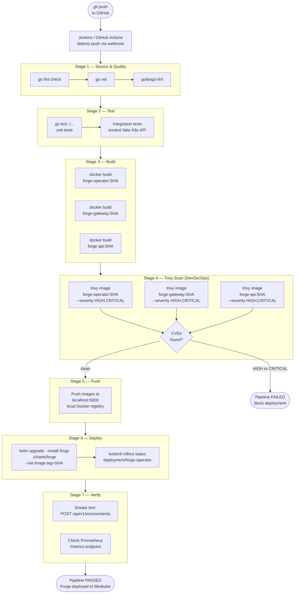

# CI/CD Pipeline

```mermaid
flowchart TD
    PUSH(["git push\nto GitHub"])

    PUSH --> TRIGGER["Jenkins / GitHub Actions\ndetects push via webhook"]

    TRIGGER --> STAGE1

    subgraph STAGE1["Stage 1 — Source & Quality"]
        FMT["go fmt check"]
        VET["go vet"]
        LINT["golangci-lint"]
        FMT --> VET --> LINT
    end

    STAGE1 --> STAGE2

    subgraph STAGE2["Stage 2 — Test"]
        UNIT["go test ./...\nunit tests"]
        INT["Integration tests\nenvtest fake K8s API"]
        UNIT --> INT
    end

    STAGE2 --> STAGE3

    subgraph STAGE3["Stage 3 — Build"]
        B1["docker build\nforge-operator:SHA"]
        B2["docker build\nforge-gateway:SHA"]
        B3["docker build\nforge-api:SHA"]
    end

    STAGE3 --> STAGE4

    subgraph STAGE4["Stage 4 — Trivy Scan (DevSecOps)"]
        T1["trivy image\nforge-operator:SHA\n--severity HIGH,CRITICAL"]
        T2["trivy image\nforge-gateway:SHA\n--severity HIGH,CRITICAL"]
        T3["trivy image\nforge-api:SHA\n--severity HIGH,CRITICAL"]
        CVE{CVEs\nfound?}
        T1 & T2 & T3 --> CVE
    end

    CVE -->|HIGH or CRITICAL| FAIL(["Pipeline FAILED\nblock deployment"])
    CVE -->|clean| STAGE5

    subgraph STAGE5["Stage 5 — Push"]
        PUSH2["Push images to\nlocalhost:5000\nlocal Docker registry"]
    end

    STAGE5 --> STAGE6

    subgraph STAGE6["Stage 6 — Deploy"]
        HELM["helm upgrade --install forge\n./charts/forge\n--set image.tag=SHA"]
        ROLLOUT["kubectl rollout status\ndeployment/forge-operator"]
        HELM --> ROLLOUT
    end

    STAGE6 --> STAGE7

    subgraph STAGE7["Stage 7 — Verify"]
        SMOKE["Smoke test:\nPOST /api/v1/environments"]
        METRICS["Check Prometheus\n/metrics endpoint"]
        SMOKE & METRICS
    end

    STAGE7 --> SUCCESS(["Pipeline PASSED\nForge deployed to Minikube"])
```
