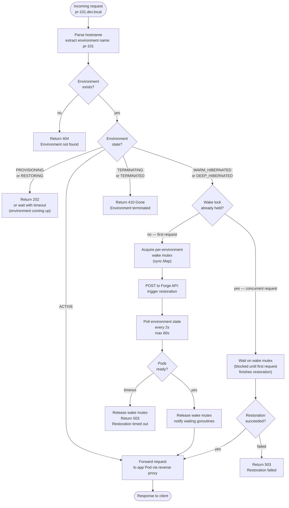

# Gateway Request Flow

```mermaid
flowchart TD
    REQ(["Incoming request\npr-101.dev.local"])

    REQ --> PARSE["Parse hostname\nextract environment name: pr-101"]
    PARSE --> EXISTS{Environment\nexists?}

    EXISTS -->|no| R404["Return 404\nEnvironment not found"]

    EXISTS -->|yes| STATE{Environment\nstate?}

    STATE -->|ACTIVE| FORWARD["Forward request\nto app Pod via reverse proxy"]
    FORWARD --> RESP(["Response to client"])

    STATE -->|PROVISIONING\nor RESTORING| WAIT["Return 202\nor wait with timeout\n(environment coming up)"]

    STATE -->|WARM_HIBERNATED\nor DEEP_HIBERNATED| LOCK{Wake lock\nalready held?}

    LOCK -->|no — first request| ACQUIRE["Acquire per-environment\nwake mutex\n(sync.Map)"]
    ACQUIRE --> TRIGGER["POST to Forge API:\ntrigger restoration"]
    TRIGGER --> POLL["Poll environment state\nevery 2s\nmax 60s"]
    POLL --> READY{Pods\nready?}
    READY -->|yes| RELEASE["Release wake mutex\nnotify waiting goroutines"]
    RELEASE --> FORWARD
    READY -->|timeout| ERR["Release wake mutex\nReturn 503\nRestoration timed out"]

    LOCK -->|yes — concurrent request| WAITLOCK["Wait on wake mutex\n(blocked until first request\nfinishes restoration)"]
    WAITLOCK --> READY2{Restoration\nsucceeded?}
    READY2 -->|yes| FORWARD
    READY2 -->|failed| ERR2["Return 503\nRestoration failed"]

    STATE -->|TERMINATING\nor TERMINATED| R410["Return 410 Gone\nEnvironment terminated"]
```
