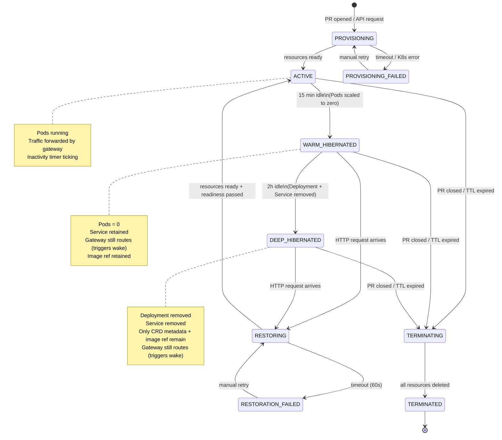

# Environment Lifecycle State Machine

```mermaid
stateDiagram-v2
    [*] --> PROVISIONING : PR opened / API request

    PROVISIONING --> ACTIVE : resources ready
    PROVISIONING --> PROVISIONING_FAILED : timeout / K8s error

    ACTIVE --> WARM_HIBERNATED : 15 min idle\n(Pods scaled to zero)
    ACTIVE --> TERMINATING : PR closed / TTL expired

    WARM_HIBERNATED --> DEEP_HIBERNATED : 2h idle\n(Deployment + Service removed)
    WARM_HIBERNATED --> RESTORING : HTTP request arrives
    WARM_HIBERNATED --> TERMINATING : PR closed / TTL expired

    DEEP_HIBERNATED --> RESTORING : HTTP request arrives
    DEEP_HIBERNATED --> TERMINATING : PR closed / TTL expired

    RESTORING --> ACTIVE : resources ready + readiness passed
    RESTORING --> RESTORATION_FAILED : timeout (60s)

    RESTORATION_FAILED --> RESTORING : manual retry
    PROVISIONING_FAILED --> PROVISIONING : manual retry

    TERMINATING --> TERMINATED : all resources deleted
    TERMINATED --> [*]

    note right of ACTIVE
        Pods running
        Traffic forwarded by gateway
        Inactivity timer ticking
    end note

    note right of WARM_HIBERNATED
        Pods = 0
        Service retained
        Gateway still routes (triggers wake)
        Image ref retained
    end note

    note right of DEEP_HIBERNATED
        Deployment removed
        Service removed
        Only CRD metadata + image ref remain
        Gateway still routes (triggers wake)
    end note
```
