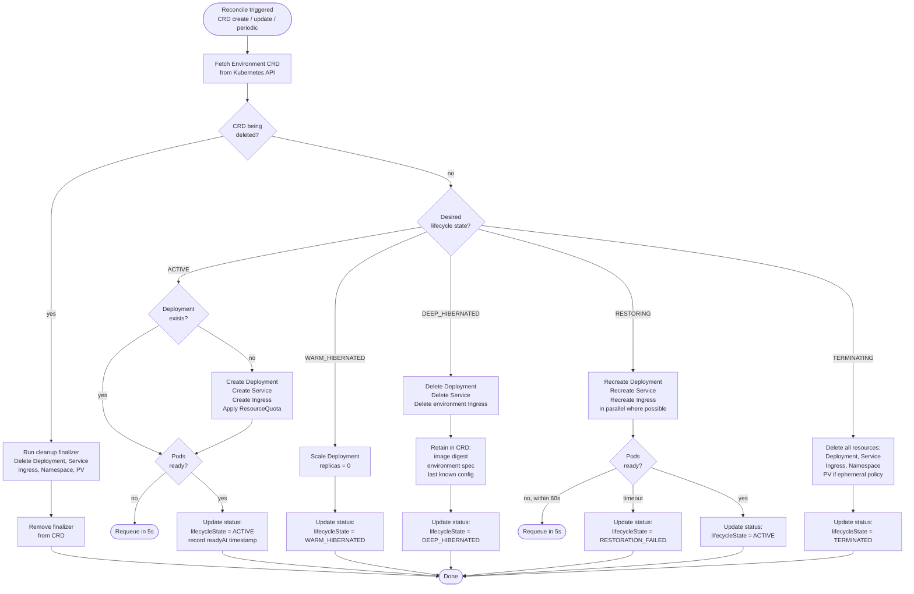

# Operator Reconciliation Loop

```mermaid
flowchart TD
    START([Reconcile triggered\nCRD create / update / periodic]) --> FETCH

    FETCH["Fetch Environment CRD\nfrom Kubernetes API"]
    FETCH --> DELETED{CRD being\ndeleted?}

    DELETED -->|yes| CLEANUP["Run cleanup finalizer\nDelete Deployment, Service\nIngress, Namespace, PV"]
    CLEANUP --> REMOVE_FIN["Remove finalizer\nfrom CRD"]
    REMOVE_FIN --> DONE([Done])

    DELETED -->|no| STATE{Desired\nlifecycle state?}

    STATE -->|ACTIVE| CHK_DEP{Deployment\nexists?}
    CHK_DEP -->|no| CREATE_DEP["Create Deployment\nCreate Service\nCreate Ingress\nApply ResourceQuota"]
    CHK_DEP -->|yes| CHK_READY{Pods\nready?}
    CREATE_DEP --> CHK_READY
    CHK_READY -->|no| REQUEUE_A([Requeue in 5s])
    CHK_READY -->|yes| SET_ACTIVE["Update status:\nlifecycleState = ACTIVE\nrecord readyAt timestamp"]
    SET_ACTIVE --> DONE

    STATE -->|WARM_HIBERNATED| SCALE["Scale Deployment\nreplicas = 0"]
    SCALE --> SET_WARM["Update status:\nlifecycleState = WARM_HIBERNATED"]
    SET_WARM --> DONE

    STATE -->|DEEP_HIBERNATED| DEL_DEP["Delete Deployment\nDelete Service\nDelete environment Ingress"]
    DEL_DEP --> RETAIN["Retain in CRD:\nimage digest\nenvironment spec\nlast known config"]
    RETAIN --> SET_DEEP["Update status:\nlifecycleState = DEEP_HIBERNATED"]
    SET_DEEP --> DONE

    STATE -->|RESTORING| REBUILD["Recreate Deployment\nRecreate Service\nRecreate Ingress\nin parallel where possible"]
    REBUILD --> WAIT_READY{Pods\nready?}
    WAIT_READY -->|no, within 60s| REQUEUE_R([Requeue in 5s])
    WAIT_READY -->|timeout| SET_FAIL["Update status:\nlifecycleState = RESTORATION_FAILED"]
    WAIT_READY -->|yes| SET_ACTIVE2["Update status:\nlifecycleState = ACTIVE"]
    SET_FAIL --> DONE
    SET_ACTIVE2 --> DONE

    STATE -->|TERMINATING| TERM["Delete all resources:\nDeployment, Service\nIngress, Namespace\nPV if ephemeral policy"]
    TERM --> SET_TERM["Update status:\nlifecycleState = TERMINATED"]
    SET_TERM --> DONE
```
