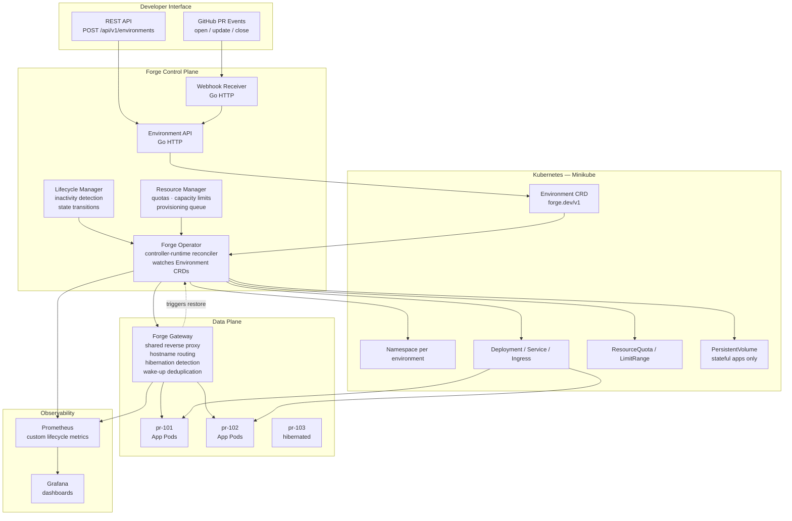

# System Architecture

```mermaid
flowchart TD
    subgraph DEV["Developer Interface"]
        GH["GitHub PR Events\nopen / update / close"]
        RAPI["REST API\nPOST /api/v1/environments"]
    end

    subgraph CP["Forge Control Plane"]
        WH["Webhook Receiver\nGo HTTP"]
        EAPI["Environment API\nGo HTTP"]
        OP["Forge Operator\ncontroller-runtime reconciler\nwatches Environment CRDs"]
        LM["Lifecycle Manager\ninactivity detection\nstate transitions"]
        RM["Resource Manager\nquotas · capacity limits\nprovisioning queue"]
    end

    subgraph K8S["Kubernetes — Minikube"]
        CRD["Environment CRD\nforge.dev/v1"]
        NS["Namespace per environment"]
        DEP["Deployment / Service / Ingress"]
        RQ["ResourceQuota / LimitRange"]
        PV["PersistentVolume\nstateful apps only"]
    end

    subgraph DP["Data Plane"]
        GW["Forge Gateway\nshared reverse proxy\nhostname routing\nhibernation detection\nwake-up deduplication"]
        E1["pr-101\nApp Pods"]
        E2["pr-102\nApp Pods"]
        E3["pr-103\nhibernated"]
    end

    subgraph OBS["Observability"]
        PROM["Prometheus\ncustom lifecycle metrics"]
        GRAF["Grafana\ndashboards"]
    end

    GH --> WH
    RAPI --> EAPI
    WH --> EAPI
    EAPI --> CRD
    CRD --> OP
    OP --> NS
    OP --> DEP
    OP --> RQ
    OP --> PV
    LM --> OP
    RM --> OP
    GW --> E1
    GW --> E2
    GW -.->|triggers restore| OP
    OP --> GW
    DEP --> E1
    DEP --> E2
    OP --> PROM
    GW --> PROM
    PROM --> GRAF
```
